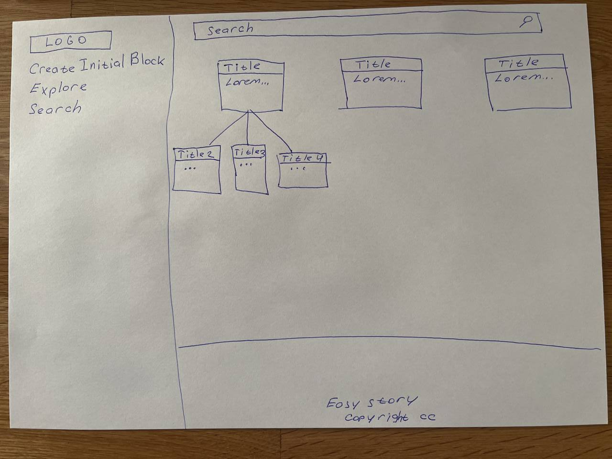
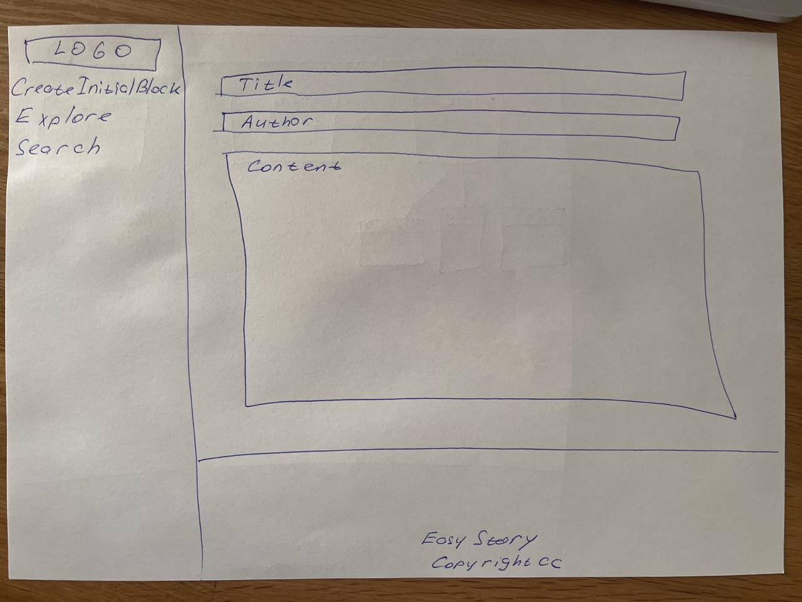

# EasyStory
На сервисе можно запостить свой блок с историей или продолжить чужую,
если вам кажется, что вы знаете что должно идти дальше.
Такие ветки будут на разные темы. Вы можете писать роман, историю, расследование, сценарий, повесть.

Темы и цензура в рамках законодательства.

## Целевая аудитория
Сегмент С2С (user to user).

Женщины, мужчины, отроки и отроковицы в возврасте от 14 до 65 лет.

В ЦА входят все слои населения с доступом к интернету и базовыми навыками обращения с комьютером / телефоном.

####Семейное положение:

не имеет значения.

####Интересы:

Чтение, написание историй, повествование, гуманитарные игры.

####Ядро ЦА:

Персоны умеющие интересно и грамотно формулировать свои мысли для своих сверстников -+ 5 лет.
Предположительно: сценаристы, стендап-комики, писатели.

####Доход ЦА:

Прожиточный минимум.

####Профессия:

Упор на гуманитариев, однако ограничений нет. Также никто не исключает учащихся.

## Описание фронтенд представления
1. Интерактивная карта блоков с фильтрами по хештегам, популярности, дате.
2. Отдельная ветка истории с именем автора первого блока, датой создания, непосредственно контентом (в нашем случае текст) и связями со следующими блоками.
3. Форма для создания блока типа WYSIWYG

## Описание MVP
### Главная

### Форма для блока истории

### Функции (эндпониты)

1. CRUDS (create, read, update, delete, search) для блоков (block)

### Описание сущности block

1. Title
2. Author
3. Content
4. CreationDate
5. UpdatedDate

## Транспортные модели, API
1. [specs](specs) - yaml OpenApi
2. [easystory-api-jackson](easystory-api-jackson) - генерация моделей и их сериализация и десериализация с помощью jackson
3. [easystory-api-kmp](easystory-api-kmp) - генерация моделей и их сериализация и десериализация на базе мультиплатформенного приложения
3. [easystory-mappers-v1](easystory-mappers-v1) - мапперы из транспортных моделей во внутренние и обратно